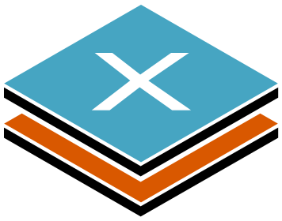

# xylograph

Xylograph is multi canvas management library of wrapping Canvas API compatible library.

## Installation

The npm module is in preparation.

## Example

If use [node-canvas](https://github.com/Automattic/node-canvas) library:
```ts
import * as fs from 'fs';
import * as NodeCanvas from "canvas";
import {Xylograph, Canvas} from "xylograph";

const width = 800;
const height = 600;

// Declare function type
interface XylographFunctionTypes {
    createCanvas: (w: number, h: number) => NodeCanvas.Canvas;
    canvasToImage: (canvas: Canvas<NodeCanvas.Canvas>) => NodeCanvas.Image;
    canvasToBinary: (canvas: Canvas<NodeCanvas.Canvas>) => Buffer;
}

// Create Xylograph
const xg = new Xylograph<NodeCanvas.Canvas, XylographFunctionTypes>({
  // Create canvas function
  createCanvas: (w: number, h: number) => NodeCanvas.createCanvas(w, h),
  // Create image from canvas
  canvasToImage: (canvas: Canvas<NodeCanvas.Canvas>) => {
    const img = new NodeCanvas.Image();
    img.src = canvas.toBuffer("image/png");
    return img;
  },
  // Create binary from canvas
  canvasToBinary: (canvas: Canvas<NodeCanvas.Canvas>) => {
    return canvas.toBuffer();
  },
  canvasWidth: width,
  canvasHeight: height
});

// Add background canvas
const bg = xg.addCanvas("background");
const bgCtx = bg.getContext("2d");
bgCtx.fillStyle = "#333333";
bgCtx.fillRect(0, 0, width, height);

// Add text canvas
const text = xg.addCanvas("text");
const textCtx = text.getContext("2d");
textCtx.fillStyle = "#ffffff";
textCtx.textAlign = "center";
textCtx.textBaseline = "middle";
textCtx.font = "bold 80px sans-serif;"
textCtx.fillText("Xylograph", width / 2, height / 2);

// Output DataURL of merged canvas.
console.log(xg.toDataURL()); // => data:image/png;base64,iVBORw0KGgoAAAANSUhEUgAAAyAAAAJYCAYAAA...

// Output image binary of merged canvas, and write to filesystem.
fs.writeFileSync("./output.png", xg.toBinary("image/png"));
```

## Documentation

### Constructor

Xylograph constructor.

```ts
new Xylograph<CanvasType, XylographFunctionTypes>(xylographOption)
```

#### Type

* `CanvasType`: Canvas type from Canvas API compatible library.
* `XylographFunctionTypes`: Defining the type of function that connects Canvas and Xylograph.

#### Arguments

* `xylographOption`: Xylograph option object.

#### XylographFunctionTypes

* `createCanvas`: Type definition of function to create a blank Canvas object.
* `canvasToImage`: Type definition of function to convert Image object from canvas.
* `canvasToBinary`: Type definition of function to convert binary from canvas.

#### xylographOption

* `createCanvas`: Function of create a blank Canvas object. Apply `XylographFunctionTypes.createCanvas` type.
* `canvasToImage`: Function of convert Image object from canvas. Apply `XylographFunctionTypes.canvasToImage` type.
* `canvasToBinary`: function of convert binary from canvas. Apply `XylographFunctionTypes.canvasToBinary` type.
* `canvasWidth`: Canvas width. Unit is `px`.
* `canvasHeight`: Canvas height. Unit is `px`.

### Xylograph.addCanvas(canvasName)

Create a canvas and add it to Xylograph object. Return of created canvas object.

```ts
xylograph.addCanvas(canvasName: string) => Canvas
```

* `canvasName`: New canvas name. If specified canvas name does existed in xylograph, add number to tail of canvas name (e.g.: `NewCanvas[1]`, `NewCanvas[2]`).

### Xylograph.getCanvas(canvasName)

Get canvas object of specified canvas name from xylograph. If specified canvas name does not exist, return of `undefined`.

```ts
xylograph.getCanvas(canvasName: string) => Canvas | undefined
```

* `canvasName`: Target canvas name.

### Xylograph.removeCanvas(canvasName)

Remove canvas of specified canvas name from xylograph.

```ts
xylograph.removeCanvas(canvasName: string) => void
```

* `canvasName`: Target canvas name.

### Xylograph.renameCanvas(targetCanvasName, newCanvasName)

Rename the canvas of the specified canvas name. Return of renamed canvas name. 

If the specified `targetCanvasName` and `newCanvasName` does invalid, or specified canvas does not exist, return of `undefined`. If specified new canvas name does existed in xylograph, add number to tail of canvas name (e.g.: `NewCanvas[1]`, `NewCanvas[2]`).

```ts
xylograph.renameCanvas(targetCanvasName: string, newCanvasName: string) => string | undefined
```

* `targetCanvasName`: Target canvas name.
* `newCanvasName`: New canvas name.

### Xylograph.moveCanvas(canvasNames)

Change the order of the canvases by specifying the canvas name. If not specified all canvas name, unspecified canvas does remove.

```ts
xylograph.moveCanvas(canvasNames: string[]) => void
```

* `canvasNames`: An array of canvas names of specified order.

### Xylograph.duplicateCanvas(originCanvasName, duplicateCanvasName)

Duplicate the canvas with the specified name. Return of duplicated canvas.

If the specified `originCanvasName` does invalid, or specified canvas does not exist, return of `undefined`. If `duplicateCanvasName` does not specified, or existed in xylograph, add number to tail of canvas name (e.g.: `NewCanvas[1]`, `NewCanvas[2]`).

```ts
xylograph.duplicateCanvas(originCanvasName: string, duplicateCanvasName?: string) => Canvas | undefined
```

* `originCanvasName`: The name of the origin canvas.
* `duplicateCanvasName`: The name of the duplicated canvas. Not required.

### Xylograph.mergeCanvas(mergeCanvasNames, forceCompositeOperation)

Merge all the specified canvases into the first one among the specified canvases. After merging, remove all canvases other than the first one. Return of merged canvas.

If the specified `mergeCanvasNames` does invalid, return of `undefined`.

```ts
xylograph.mergeCanvas(mergeCanvasNames: string[], forceCompositeOperation?: string) => Canvas | undefined
```

* `mergeCanvasNames`: The name of specified canvases.
* `forceCompositeOperation`: Force composite operation. If specified `forceCompositeOperation`, use `forceCompositeOperation` value instead of `compositeOperation` property of canvas. Not required.

### Xylograph.getCanvases()

Get all the canvases in xylograph. Return the canvas array. 

```ts
xylograph.getCanvases() => Canvas[]
```

### Xylograph.setCanvases(canvases)

Replace canvases of xylograph.

```ts
xylograph.setCanvases(canvases: Canvas[]) => void
```

* `canvases`: The canvas array to replace.

### Xylograph.getCanvasNames()

Get all canvas names in xylograph. Return the string array.

```ts
xylograph.getCanvasNames() => string[]
```

### Xylograph.resize(width, height, sx, sy, sw, sh)

Resize all canvases in xylograph.

```ts
xylograph.resize(width: number, height: number, sx?: number, sy?: number, sw?: number, sh?: number) => void
```

* `width`: Resized canvas width.
* `height`: Resized canvas height.
* `sx`: Clipping start X position. Not required.
* `sy`: Clipping start Y position. Not required.
* `sw`: Clipping width. Not required.
* `sh`: Clipping height. Not required.

### Xylograph.toDataURL()

Get data URL merging all canvases in xylograph.

```ts
xylograph.toDataURL() => string
```

### Xylogrpah.toBinary()

Get binary data merging all canvases in xylograph.

```ts
xylograph.toBinary(...args: any[]) => any
```

The argument and return type are of the type specified by the type system.

e.g.
```ts
interface toBinaryOption {
  quality: number;
}
interface XylographFunctionTypes {
    // ...
    canvasToBinary: (canvas: Canvas<NodeCanvas.Canvas>, mimeType?: string, option?: toBinaryOption) => Buffer;
}

const xg = new Xylograph<NodeCanvas.Canvas, XylographFunctionTypes>({
  // ...
  canvasToBinary: (canvas: Canvas<NodeCanvas.Canvas>, mimeType?: binaryMimeType, option?: toBinaryOption) => {
    if(mimeType == "image/jpeg") return canvas.toBuffer(mimeType, option);
    return canvas.toBuffer();
  },
  // ...
});

// The added arguments are passed to the second and subsequent arguments of the canvasToBinary function.
xylograph.toBinary("image/jpeg", { quality: 0.5 }) // => Buffer

```

### Canvas.xylograph

Additional property of Canvas object.

```ts
canvas.xylograph: {
  readonly name: string;
  compositeOperation: string;
  hidden: boolean;
}
```

* `name`: Canvas name in xylograph object. ***Read-only property (If rename use `renameCanvas` method).***
* `compositeOperation`: A composite operation to be used when composing with another canvas. Specifies permitted compositing operations in a Canvas API compatible interface.
* `hidden`: Hide it when merging with other canvases.

```ts
canvas.xylograph.compositeOperation = "screen";
canvas.xylograph.hidden = true;

// Rename
xylograph.renameCanvas("targetName", "newName");
```